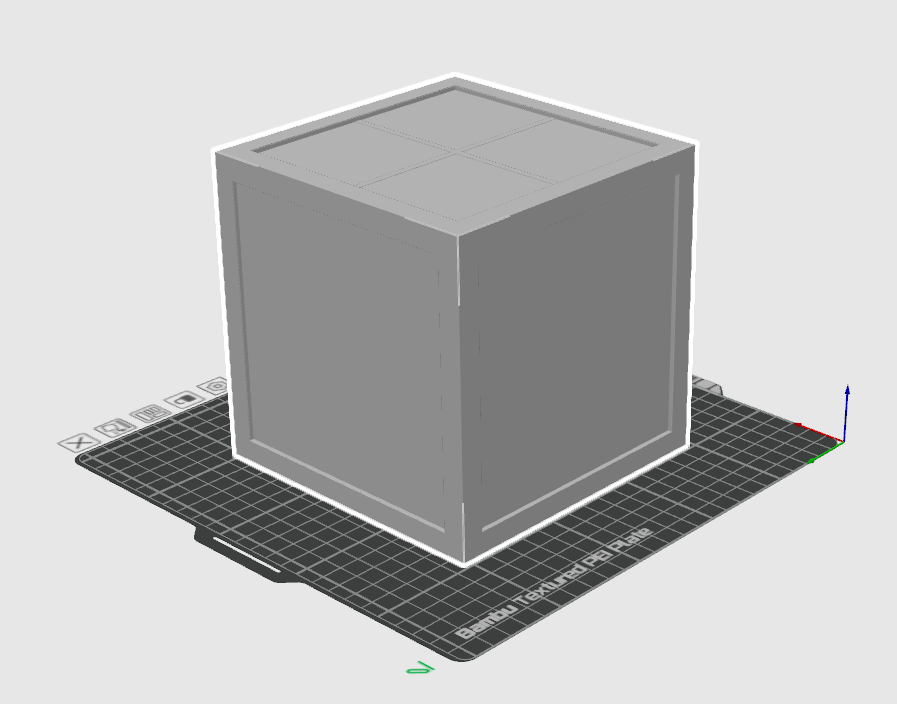
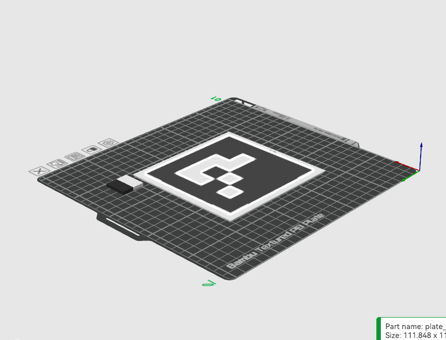

# 📦 ArUco Cube STL Generator

Generate a **hollow calibration cube** and **multicolor ArUco marker plates** entirely in Python — perfect for camera calibration, robotics, tracking experiments, and multi-color 3D printing using Bambu Lab AMS.


## 🖼 Preview

<table>
  <tr>
    <td align="center">
      <strong>Hollow Cube with Recessed Faces</strong><br/>
      
    </td>
    <td align="center">
      <strong>ArUco Plate (Base + Marker)</strong><br/>
      
    </td>
  </tr>
</table>


## 🚀 Features

### 🧊 Cube Generator
- Produces a **hollow cube** with:
  - Outer edge: **120 mm**
  - Wall thickness: **6 mm**
  - **Five recessed faces** (top, +X, -X, +Y, –Y)
  - Flat bottom for strong print adhesion
- Recesses are **3 mm deep** for secure snap-fit plates.

### 🧩 ArUco Plate Generator
- Generates 4×4 ArUco markers (`DICT_4X4_50`)
- **3 mm thick plates**  
- **0.8 mm raised marker pixels** for two-color AMS printing

### 🛠️ Outputs
For each ID, the script generates:
- `plate_base_idX.stl`
- `plate_marker_idX.stl`
- `plate_combined_idX.stl`

Also:
- `cube_with_slots.stl`
- `plate_base.stl`

---

## 📂 Project Structure

```
.
├── aruco_cube_stls.py
├── README.md
└── output/
    ├── cube_with_slots.stl
    ├── plate_base.stl
    ├── plate_base_id0.stl
    ├── plate_marker_id0.stl
    ├── plate_combined_id0.stl
    └── …
```

---

## ⚙️ Configuration (inside `aruco_cube_stls.py`)

```python
CUBE_EDGE = 120.0
WALL_THICKNESS = 6.0
SLOT_FRACTION = 0.8
SLOT_DEPTH = 3.0
CLEARANCE = 0.2

PLATE_MARGIN_FRACTION = 0.9
ARUCO_MARKER_BITS = 4
ARUCO_BORDER_BITS = 1
ARUCO_IMAGE_SIZE = 200
MARKER_HEIGHT = 0.8

PLATE_IDS = [0, 1, 2, 3, 4]
```

---

## 📦 Installation

We recommend using a virtualenv:

```bash
python -m venv venv
source venv/bin/activate
pip install --upgrade pip
```

Install dependencies:

```bash
pip install numpy trimesh shapely
pip install opencv-contrib-python
pip install "trimesh[easy]"
```

⚠️ **Important:** Only `opencv-contrib-python` contains the ArUco module.

---

## ▶️ Running the Generator

```bash
python aruco_cube_stls.py
```

Generated files include:

```
cube_with_slots.stl
plate_base.stl
plate_base_idX.stl
plate_marker_idX.stl
plate_combined_idX.stl
```

---

## 🖨 Printing in Bambu Studio (AMS Multicolor)

### 1. Cube (single color)
- Import `cube_with_slots.stl`
- **Supports: OFF**
- Prints like a normal hollow box (top layers supported by infill)

### 2. Plates (two colors)
For each ID:

1. Import:
   - `plate_base_idX.stl` (assign white)
   - `plate_marker_idX.stl` (assign black)
2. Models load aligned; if not:  
   **Right-click → Align → Center (XYZ)**
3. Supports: **OFF**
4. Print

---

## 🧱 Assembly

- Press-fit plates into cube recesses (0.2 mm clearance)
- Optional: add a tiny drop of CA glue in corners

---

## 🔧 Troubleshooting

### Missing ArUco functions
```bash
pip uninstall -y opencv-python opencv-python-headless
pip install opencv-contrib-python
```

### Boolean operation failures
```bash
pip install "trimesh[easy]"
```

---

## 📜 License
MIT License

---


